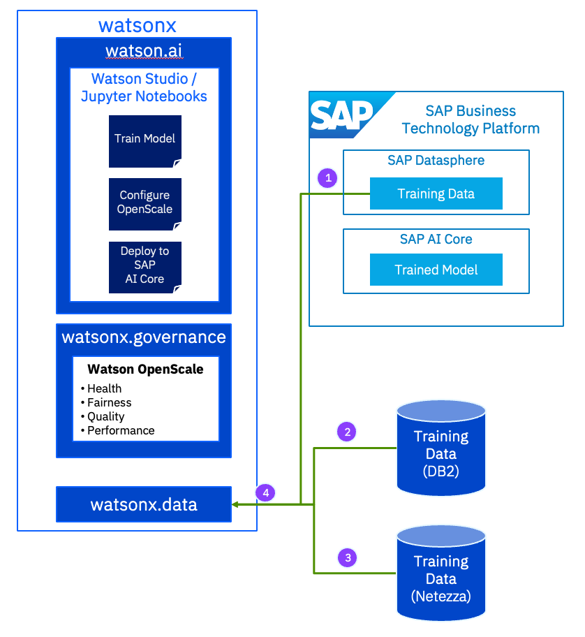

# watsonx.data Demo

This example demonstrates:
1. Connecting Db2 to watsonx.data.
2. Connecting watsonx.data's Presto engine to Watson Studio as a data source.
3. Using Watson Studio to explore the data and use its Visualization capability to graph the data.
4. Connecting SAP Datasphere in Watson Studio as a data source.
5. Using a notebook in Watson Studio to join the data from different data sources.

