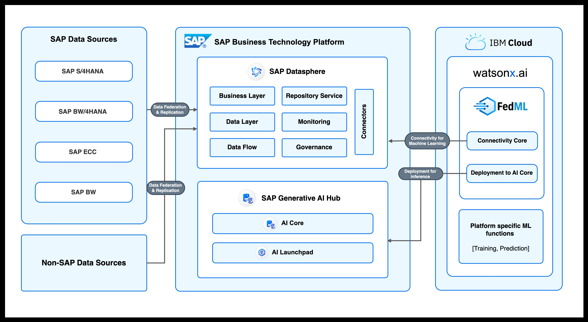

# SAP FedML Demo

This example demonstrates:
1. Accessing data stored in SAP Datasphere using FedML
2. Training a Machine Learning model in IBM® watsonx.ai™ AI studio (a.k.a. Watson Studio)
2. Serving the trained model in SAP AI Core using FedML
3. Making inference calls using FedML

