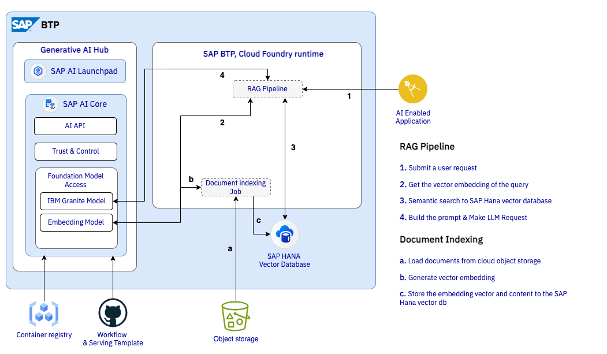

# SAP Q&A RAG Pipeline

This application implements a SAP Q&A Retrieval-Augmented Generation (RAG) Pipeline, integrating advanced components to deliver accurate responses using a Large Language Model (LLM).

---

## Workflow Overview

1. **Embedding Model**:
   - Encodes the query into a vector representation for semantic matching.

2. **SAP HANA Vector Database**:
   - Executes a semantic search to retrieve relevant documents, constructing a context for the query.

3. **Prompt Construction**:
   - Combines the retrieved context with the query to create a prompt for the LLM.

4. **LLM (IBM Granite Model)**:
   - Generates the final response based on the constructed prompt.

---



## Running the Application Locally

Follow these steps to set up and run the application on your local machine.

### Step 1: Set Up the Python Environment

Create and activate a virtual environment to manage dependencies:

```bash
python3 -m venv backend
source backend/bin/activate
```

### Step 2: Install Dependencies

Install the required Python packages:

```bash
pip3 install -r requirements.txt
```  

### Step 3: Configure Environment Variables

Create a `.env` file and populate it with the necessary credentials and configurations, using the provided `env-example` file as a reference. More details can be found in the example file.

```bash
cp env-exsample .env
```

### Step 4: Run the Application

Start the application server:

```bash
python3 main.py
```

---

## Run it on Docker and other Container Platform

### Step 5: Build the Docker Image

Build the Docker image using the provided `Dockerfile`:

```bash
docker build --no-cache -t docker.io/<user>/rag-pipeline:latest .
```

### Step 6: Publish the Docker Image

Push the Docker image to the registry, so that you can use it later for deployment:

```bash
docker push docker.io/<user>/rag-pipeline:latest
```

> **Note**: Save the container image url, which will be used for deploying the RAG Pipeline on SAP AI Core.  

---

## Next Steps  

- **Integration with SAP AI Core**:  
  - Use the published container image to deploy the RAG pipeline on SAP AI Core to enable secure access and seamless integration.  
- **Customization**:  
  - Extend the pipeline by integrating additional models, enhancing prompt construction, or fine-tuning the IBM Granite model.  

Harness the power of semantic search and LLMs to build smarter and more efficient Q&A solutions with SAP's Q&A RAG Pipeline! 🚀
