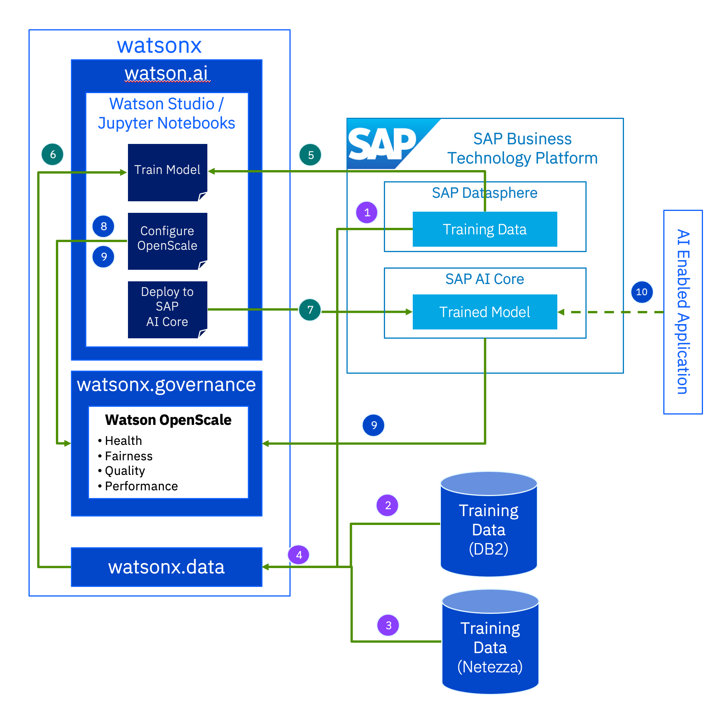

# watsonx Integration with SAP AI Core and SAP Datasphere

## Introduction
This repo demonstrates different ways watsonx can be used with SAP's AI Core and Datasphere for AI model training, deployment, and governance monitoring. 

### SAP Datasphere
[SAP Datasphere](https://help.sap.com/docs/SAP_DATASPHERE) provides a business data fabric infrastructure that can work across an organization to bring together mission-critical data. SAP Datasphere allows you to converge data coming from SAP and third-party on-premise and cloud environments into a single, fully-managed cloud environment.
 
### SAP AI Core
The [SAP AI Core](https://help.sap.com/docs/sap-ai-core) service in the [SAP Business Technology Platform (BTP)](https://help.sap.com/docs/btp) handles the execution and operations of your AI assets in a standardized, scalable, and hyperscaler-agnostic way.

### watsonx Integration
[Watsonx](https://www.ibm.com/watsonx) is an AI and data platform with three core components (watsonx.ai, watsonx.data, and watsonx.governance) and a set of AI assistants designed to help you scale and accelerate the impact of AI with trusted data across your business. It leverages the best open source tools and technologies available and combines them with IBM research innovations to enable enterprise-ready AI workflows, that are built with responsibility, transparency, and explainability, thoughout the AI lifecycle.

This architecture diagram will be used in our integration discussion.

#### Data Ingestion
Gathering model training data often requires retrieving and joining data from multiple data sources. While this can be done directly in a notebook, this approach may not scale for large datasets or when data security limits data visibility. The watsonx.data tutorial explores ways to retrieve and join data from multiple databases using watsonx.data.

#### Data Exploration
The watsonx.ai Studio provides Jupyter notebook environments that can be used for data exploration. Studio also provides a visualization environment with a large selection of graph types to explore all aspects of your data.

#### Model Training
Models can be trained in a Jupyter notebook running in Watson Studio, which provides a secure environment for sensitive data. Training data could be retrieved from watsonx.data (path #6) or pulled directly from a database (path #5 shows direct data retrieval from SAP Datasphere). The model is created, fine-tuned, and evaluated in this environment.

#### Model Deployment
Once trained, the model can be deployed to SAP AI Core (path #7) where it can be invoked for inferencing.

#### Model Governance
watsonx.governance enables you to track the prominence of data used to train a model (this is done in IBM OpenPages) and to monitor the health and model performance over time (this is done in IBM OpenScale). OpenScale gives the ability to monitor a model for ongoing fairness, quality, and explainability.

Configuring a model for OpenScale monitoring requires:
1. Configuring OpenScale to receive monitoring data from the model (path #7).
2. Configuring the fairness, quality, and explainability settings for the model (path #8).

After the model has been configured for monitoring, invoking the model causes it to return metrics to OpenScale (path #9).

#### Model in Production
With the model and governance in place, it can now be invoked by an application to score data (path #10).

Prior to model training a data scientist wants to explore the data to get a feel for relationships between 

==========================================================================

## 1. watsonx.ai

### 1.1 Supply Chain Use Case

This example demonstrates watsonx retrieving training data from SAP Datasphere, training a model in Watson Studio, and then deploying the model to SAP AI Core.

The model trained in this example is a Watson NLP text classification model that predicts the recommended emergency handling protocols for different types of hazardous materials based on information found in the bill of lading. Details on the use case can be found [here](./1.%20watsonx.ai/1.1%20Supply%20Chain%20Use%20Case/README.md)

Two Jupyter Notebooks are provided to demonstrate the complete end-to-end flow:

1. [Train a classification model for MSDS in IBM Watson Studio](1.%20watsonx.ai/1.1%20Supply%20Chain%20Use%20Case/notebooks/Train-Model-with-Data-from-SAP-Datasphere.ipynb)
1. [Deploy the custom-trained model to SAP AI Core](1.%20watsonx.ai/1.1%20Supply%20Chain%20Use%20Case/notebooks/Deploy-Custom-Model-to-SAP-AI-Core.ipynb)

### 1.2 HR Use Case

In this example, we train a Random Forest Classification model in Watson Studio for predicting employee promotions, build a container image for model deployment, and then deploy the model to SAP AI Core.

More details on the use case can be found in the following notebooks:

1. [train-epp-model.ipynb](1.%20watsonx.ai/1.1%20HR20Use%20Case/notebooks/train-epp-model.ipynb)
1. [deploy-epp-model.ipynb](1.%20watsonx.ai/1.1%20HR%20Use%20Case/notebooks/deploy-epp-model.ipynb)

==========================================================================

## 2. watsonx.data

The watsonx.data [example](2.%20watsonx.data/2.1%20HR%20Use%20Case/README.md) provides a quick view of what it takes to connect a database to watsonx.data and then to connect its Presto query engine to Watson Studio as a data souce. As an added treat, Watson Studio's visualzation capabilities are explored.

==========================================================================

## 3. watsonx.governance

The watsonx.governance [example](3.%20watsonx.governance/3.1%20HR%20Use%20Case/README.md) shows configuring Watson OpenScale governance to monitor the quality and fairness of an HR model that predicts if an employee will be promoted soon. 

=================================================

### Disclaimer

This framework is developed by Build Lab, IBM Ecosystem. Please note that this content is made available to foster Embeddable AI technology adoption and serve ecosystem partners. The content may include systems & methods pending patent with the USPTO and protected under US Patent Laws. SuperKnowa is not a product but a framework built on the top of IBM watsonx along with other products like LLAMA models from Meta & ML Flow from Databricks. Using SuperKnowa implicitly requires agreeing to the Terms and conditions of those products. This framework is made available on an as-is basis to accelerate Enterprise GenAI applications development. In case of any questions, please reach out to kunal@ibm.com.

Copyright @ 2023 IBM Corporation.
