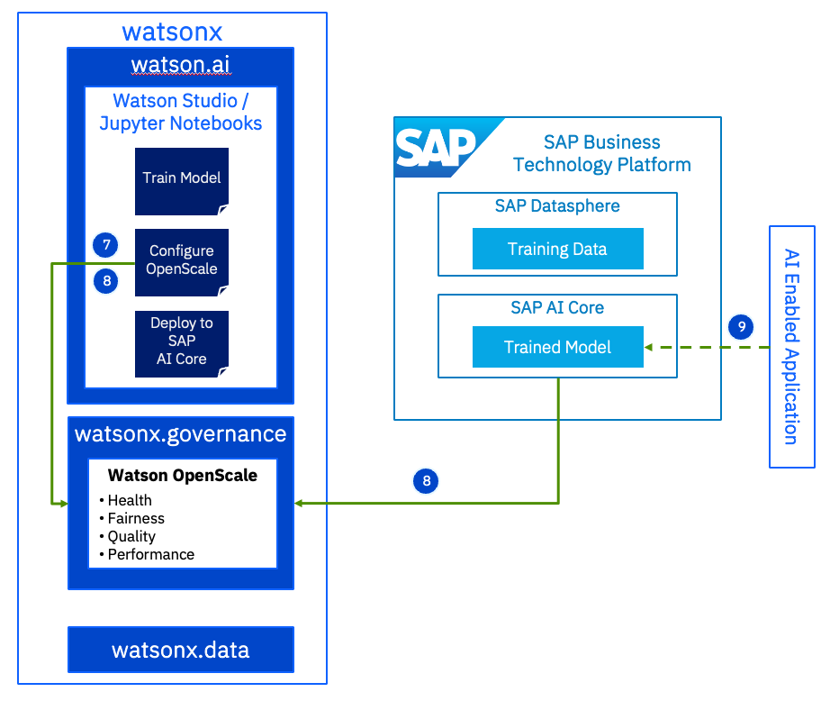

# watsonx.governance Demo

This example demonstrates:
1. Configuring Openscale to monitor a model.
2. Configuring the model to send fiarness, quality, and explainability data.
3. Invoking the model in AI Core and seeing it report monitoring metrics to OpenScale.

